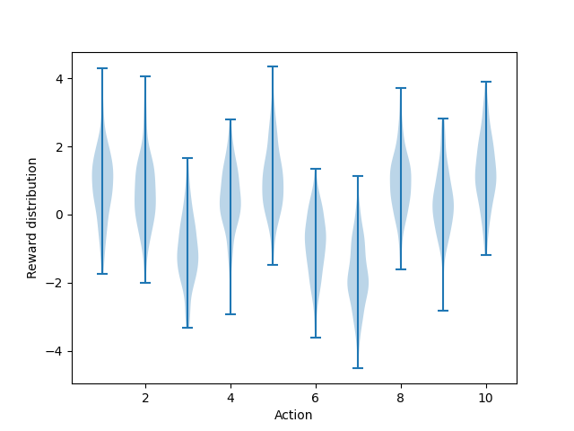
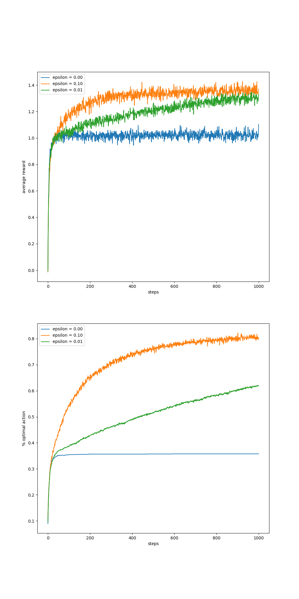
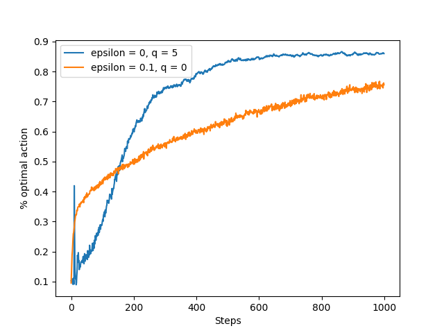
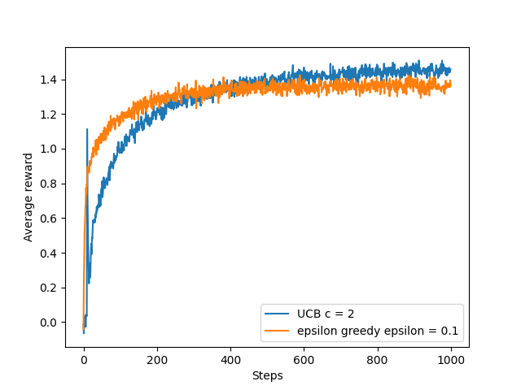
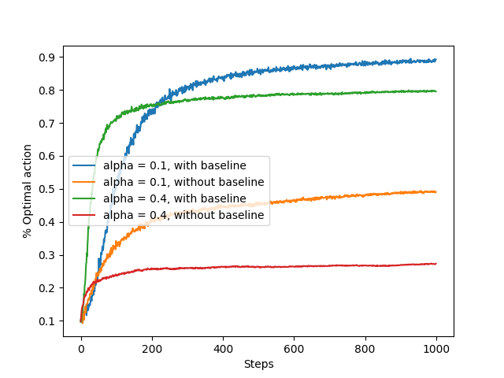
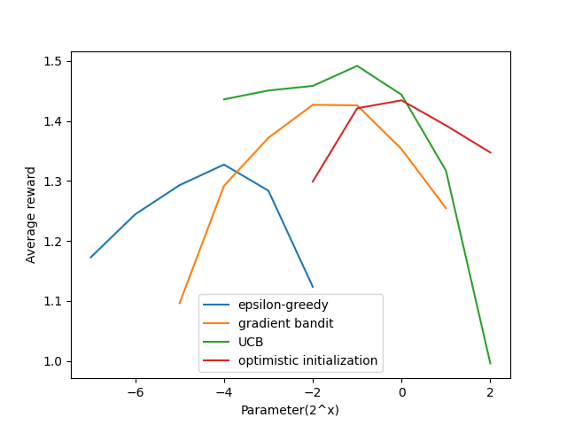

# The 10-Armed Testbed: A Study of Action-Value Methods

This document walks through the key ideas from **Chapter 2** of Sutton & Barto's *Reinforcement Learning: An Introduction (2nd Edition)*, using the code in [`ten_armed_testbed.py`](ten_armed_testbed.py) as a hands-on companion. Each section maps to a figure produced by the script and to the corresponding concept in the book.

---

## Table of Contents

1. [The Multi-Armed Bandit Problem](#1-the-multi-armed-bandit-problem)
2. [The Exploration vs. Exploitation Dilemma](#2-the-exploration-vs-exploitation-dilemma)
3. [Optimistic Initial Values](#3-optimistic-initial-values)
4. [Upper-Confidence-Bound (UCB) Action Selection](#4-upper-confidence-bound-ucb-action-selection)
5. [Gradient Bandit Algorithms](#5-gradient-bandit-algorithms)
6. [Comparing All Methods: A Parameter Study](#6-comparing-all-methods-a-parameter-study)
7. [Running the Code](#7-running-the-code)

---

## 1. The Multi-Armed Bandit Problem

Imagine you are in a casino facing a row of 10 slot machines (the "arms"). Each time you pull an arm, you receive a numerical reward drawn from a probability distribution specific to that arm. You don't know these distributions in advance. Your goal is to maximize your total reward over a sequence of plays.

This is the **k-armed bandit problem** (here k = 10). It distills the central challenge of reinforcement learning into its simplest form: you must **learn** which actions are good by trying them, while simultaneously **earning** reward by choosing what you currently believe is best.

### How the testbed is constructed

In the code, the `Bandit` class models one instance of this problem:

- **True action values** `q*(a)` are sampled once per run from a standard normal distribution `N(0, 1)`.
- When action `a` is selected, the **reward** is drawn from `N(q*(a), 1)` -- a noisy version of the true value.

The violin plot below (Figure 2.1) shows one such randomly generated problem. Each violin represents the reward distribution for one of the 10 actions. The center of each violin sits at `q*(a)`, and the spread reflects the unit-variance noise added to every reward.



**Key takeaway:** The agent does not see these distributions. It must estimate them from sampled rewards, which is inherently noisy. The overlap between distributions means that a single reward sample can be misleading -- an inferior arm can occasionally return a higher reward than the best arm.

---

## 2. The Exploration vs. Exploitation Dilemma

The most fundamental tension in the bandit problem is between:

- **Exploitation** -- choosing the action with the highest estimated value (the *greedy* action) to maximize immediate reward.
- **Exploration** -- choosing a non-greedy action to improve your estimates and potentially discover a better action.

### Epsilon-Greedy Methods

The simplest way to balance exploration and exploitation is the **epsilon-greedy** strategy: with probability `1 - epsilon`, select the greedy action; with probability `epsilon`, select an action uniformly at random.

The code compares three settings:

| Strategy | epsilon | Behavior |
|---|---|---|
| Pure greedy | 0.00 | Never explores -- always exploits current estimates |
| Moderate exploration | 0.10 | Explores 10% of the time |
| Light exploration | 0.01 | Explores 1% of the time |

All three use **sample averages** to estimate action values:

```
Q(a) = (sum of rewards when a was taken) / (number of times a was taken)
```

This is the simplest unbiased estimator of `q*(a)`.



### Reading the results

- **Greedy (epsilon = 0):** Learns quickly at first but gets stuck at a suboptimal level. It locks onto whichever action *happened* to look best early on and never corrects its mistake. It finds the optimal action only about 35% of the time.
- **epsilon = 0.10:** Explores frequently, so it reliably discovers the best arm. It achieves the highest long-run optimal-action percentage (~80%) and the highest average reward. However, even after finding the best action, it still explores 10% of the time, which costs a small amount of reward.
- **epsilon = 0.01:** Explores slowly but steadily. It improves more gradually than epsilon = 0.10 but is still climbing at 1000 steps. Given enough time, it would likely match or surpass the 0.10 agent in average reward because it wastes less time on known-bad arms.

**Key takeaway:** Some exploration is essential. A purely greedy agent performs significantly worse in the long run. The *rate* of exploration controls a tradeoff between speed of learning and long-term optimality.

---

## 3. Optimistic Initial Values

Rather than starting with all estimates at zero, what if we start with **optimistically high** initial values? If we initialize `Q(a) = 5` for all actions (well above the true values, which average around 0), then every action the agent tries will produce a reward lower than expected. This "disappointment" drives the agent to try other actions, achieving exploration *without* an explicit epsilon.

This is called the **optimistic initial values** trick.

The code compares:

| Method | epsilon | Initial Q | Step Size |
|---|---|---|---|
| Optimistic greedy | 0.00 | 5.0 | 0.1 (constant) |
| Realistic epsilon-greedy | 0.10 | 0.0 | 0.1 (constant) |

Both use a constant step size `alpha = 0.1` rather than sample averages, which means recent rewards are weighted more heavily.



### Reading the results

- The **optimistic method** starts poorly -- its initial spike and crash reflects the agent trying each arm, being "disappointed," and moving on. But this systematic early exploration pays off: it converges to a higher percentage of optimal actions (~86%) than the epsilon-greedy agent (~75%).
- The **epsilon-greedy method** learns more smoothly but never stops exploring, which prevents it from fully committing to the best arm.

**Key takeaway:** Optimistic initialization is a simple and effective technique to encourage early exploration. Its limitation is that it is a *one-time* trick -- it only drives exploration at the start and is not well suited to non-stationary problems where the true values change over time.

---

## 4. Upper-Confidence-Bound (UCB) Action Selection

Epsilon-greedy explores blindly -- when it explores, it picks a random action regardless of how uncertain the agent is about that action. A smarter approach would favor actions that the agent is *less certain* about.

**Upper-Confidence-Bound (UCB)** action selection does exactly this:

```
A_t = argmax_a [ Q_t(a) + c * sqrt( ln(t) / N_t(a) ) ]
```

where:
- `Q_t(a)` is the current estimate of action `a`'s value
- `N_t(a)` is the number of times action `a` has been selected
- `t` is the total number of steps so far
- `c` controls the degree of exploration

The square-root term is an **uncertainty bonus**. Actions that have been tried less often (small `N_t(a)`) or that haven't been tried recently (as `t` grows) get a larger bonus. This naturally balances exploration and exploitation: uncertain actions are given the benefit of the doubt.

The code compares UCB (`c = 2`) against epsilon-greedy (`epsilon = 0.1`), both using sample averages.



### Reading the results

- **UCB** consistently outperforms epsilon-greedy. It reaches near-optimal performance faster because its exploration is *directed* -- it tries uncertain actions rather than random ones.
- The gap is most visible in the first few hundred steps, where intelligent exploration matters most.

**Key takeaway:** UCB is a principled way to explore that accounts for estimation uncertainty. It performs well on stationary bandit problems, though it can be more difficult to extend to the full reinforcement learning setting (non-stationary problems, large state spaces).

---

## 5. Gradient Bandit Algorithms

All methods so far estimate action *values*. An entirely different approach is to learn a *preference* `H(a)` for each action and select actions according to a **softmax distribution**:

```
Pr(A_t = a) = exp(H_t(a)) / sum_b exp(H_t(b))
```

The preference `H(a)` is not an estimate of reward -- it is a relative ranking. Only the differences between preferences matter. The update rule, derived from stochastic gradient ascent on expected reward, is:

```
H_{t+1}(a) = H_t(a) + alpha * (R_t - baseline) * (1_{A_t=a} - pi_t(a))
```

where:
- `alpha` is the step size
- `R_t` is the reward received
- `baseline` is typically the average of all past rewards
- `1_{A_t=a}` is 1 if action `a` was selected, 0 otherwise
- `pi_t(a)` is the current probability of selecting action `a`

The **baseline** is critical: without it, the algorithm has no frame of reference for whether a reward is "good" or "bad."

The code tests four configurations with `true_reward = 4` (shifting all true values up, which makes the baseline especially important):

| Config | Step Size (alpha) | Baseline? |
|---|---|---|
| 1 | 0.1 | Yes |
| 2 | 0.1 | No |
| 3 | 0.4 | Yes |
| 4 | 0.4 | No |



### Reading the results

- **With baseline** (blue and green): Both step sizes learn effectively, with `alpha = 0.4` learning faster initially and `alpha = 0.1` reaching a slightly higher asymptote (~90% optimal).
- **Without baseline** (orange and red): Performance is dramatically worse. Without a baseline, all rewards are positive (since the true means are around 4), so the algorithm treats *every* outcome as positive reinforcement and fails to differentiate good actions from bad ones. The larger step size (`alpha = 0.4`) without baseline performs worst of all.

**Key takeaway:** The gradient bandit algorithm offers a fundamentally different approach to the bandit problem -- learning policies directly rather than estimating values. The reward baseline is not just a nice-to-have; it is essential for the algorithm to function correctly.

---

## 6. Comparing All Methods: A Parameter Study

Each method has one or more hyperparameters. How do we fairly compare them? The standard approach is a **parameter study**: sweep each method's key parameter over a range of values and compare their best performances.

The code sweeps:

| Method | Parameter | Range (as 2^x) |
|---|---|---|
| Epsilon-greedy | epsilon | 2^(-7) to 2^(-2) |
| Gradient bandit | alpha | 2^(-5) to 2^(1) |
| UCB | c | 2^(-4) to 2^(2) |
| Optimistic greedy | Q_0 (initial value) | 2^(-2) to 2^(2) |

Each configuration is run for 1000 steps over 2000 independent runs. The y-axis shows average reward over the entire 1000 steps, providing a single summary statistic for each parameter value.



### Reading the results

- **UCB** (green) achieves the highest peak performance and is relatively robust across a wide range of `c` values.
- **Optimistic initialization** (red) also performs well at its best parameter setting and has a broad effective range.
- **Gradient bandit** (orange) performs well in its optimal range but degrades at extreme step sizes.
- **Epsilon-greedy** (blue) is the simplest method and performs reasonably, but its peak is lower than the others.

All methods are sensitive to their parameters -- none is universally best at every parameter setting. The inverted-U shape of each curve reflects the fundamental tradeoff: too little exploration (left side) causes the agent to miss the best arm; too much exploration (right side) wastes time on suboptimal arms.

**Key takeaway:** No single method dominates across all settings. The choice of method *and* its hyperparameter both matter. UCB tends to be a strong default choice for stationary bandit problems, but every method has a regime where it excels.

---

## 7. Running the Code

### Prerequisites

```bash
pip install numpy matplotlib tqdm
```

### Execution

From the `chapter02` directory:

```bash
python ten_armed_testbed.py
```

This generates all six figures in the `images/` directory. The simulation runs 2000 independent bandit problems for 1000 steps each per configuration, so expect it to take several minutes (Figure 2.6 is the slowest since it sweeps many parameter values).

### Code Structure

The script is self-contained in a single file with two main components:

- **`Bandit` class** -- Encapsulates a single k-armed bandit agent. Handles action selection (greedy, epsilon-greedy, UCB, gradient) and value/preference updates (sample average, constant step size, gradient ascent).
- **`simulate()` function** -- Runs multiple independent bandit problems and collects statistics (average reward and % optimal action) across runs.
- **`figure_2_X()` functions** -- Each configures the appropriate bandits, calls `simulate()`, and produces the corresponding plot.

---

## Summary of Key Ideas

| Concept | Core Idea | Strength | Weakness |
|---|---|---|---|
| **Greedy** | Always pick the best-known action | Maximizes short-term reward | Gets stuck on suboptimal actions |
| **Epsilon-greedy** | Explore randomly with probability epsilon | Simple, guaranteed exploration | Exploration is undirected |
| **Optimistic initialization** | Start estimates high to encourage exploration | Simple, effective early exploration | One-time trick, not suited for non-stationary problems |
| **UCB** | Prefer uncertain actions | Directed, principled exploration | Harder to extend beyond bandits |
| **Gradient bandit** | Learn action preferences, not values | Different paradigm, works well with baseline | Requires careful tuning, baseline is essential |

These methods form the foundation for understanding the exploration-exploitation tradeoff that permeates all of reinforcement learning. The 10-armed testbed is a controlled laboratory for studying these ideas before encountering the additional complexities of states, transitions, and long-term planning in full RL problems.

---

*Based on Chapter 2 of Sutton & Barto's Reinforcement Learning: An Introduction (2nd Edition). Code originally by Shangtong Zhang et al.*
